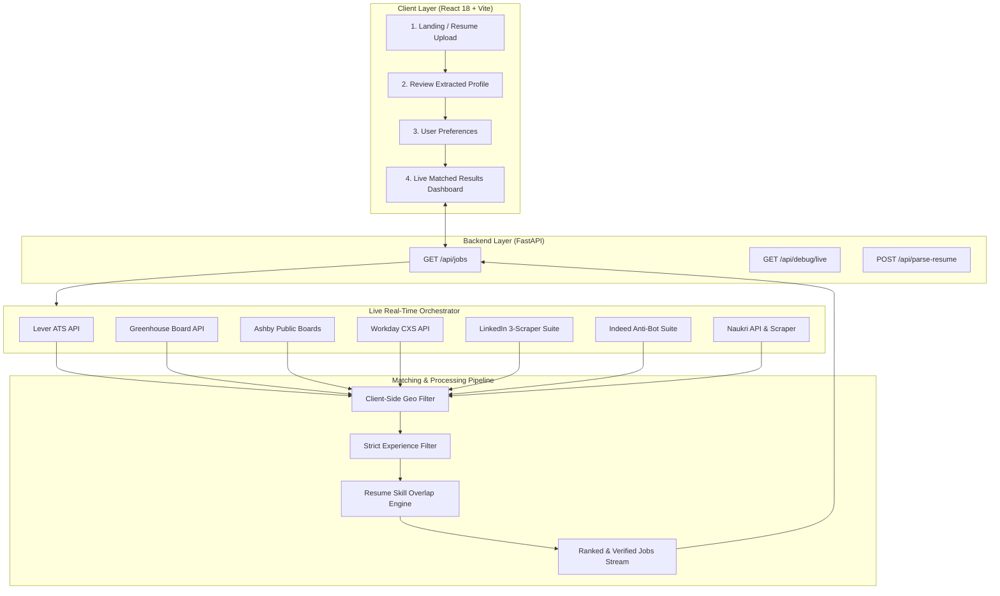

<div align="center">

# ⚡ HirePulse — Universal Real-Time Job Engine

<p align="center">
  <strong>An AI-powered, resume-aware universal job aggregation and smart matching engine.</strong><br>
  Fetches 100% live job openings from 7 real-time sources with zero mock or seed data.
</p>

[](https://reactjs.org/)
[](https://vitejs.dev/)
[](https://tailwindcss.com/)
[](https://fastapi.tiangolo.com/)
[](https://www.python.org/)
[](https://github.com/D4Vinci/Scrapling)

<br/>

[Features](#-key-features) • [Architecture](#-system-architecture) • [Sources](#-7-live-data-sources) • [Getting Started](#-quick-start) • [API Docs](#-api-endpoints) • [Telemetry](#-live-verification-telemetry)

</div>

---

## 🌟 Overview

**HirePulse** is a modern full-stack platform designed to revolutionize the job hunt. Unlike traditional job boards that rely on outdated database snapshots or fake sample listings, HirePulse queries **live public ATS endpoints and job board feeds concurrently** at search time.

It analyzes candidate resumes, extracts core competencies and career timeline, isolates the candidate's exact intent (Role, Location, Experience Bracket), and runs a multi-factor smart matching algorithm to rank opportunities by true fit.

---

## ✨ Key Features

- 🚫 **Zero Seed / Mock Data Policy**: Every job posting is fetched live over HTTP from official career APIs and job boards with real-time UTC timestamps.
- ⚡ **3-Scraper Parallel System**: Employs Scrapling (Stealth anti-bot bypass), Crawl4AI (DOM rendering), and ScrapeGraph AI to eliminate 999 blocks and Cloudflare captchas on LinkedIn and Indeed.
- 🎯 **Role-Only Querying + Skill-Only Scoring**:
  - Search queries pass clean role and location constraints (`q=Frontend Developer in Bangalore`).
  - Candidate resume skills are evaluated strictly inside the matching engine to calculate percentage match scores.
- 📍 **Client-Side Geo Isolation**: Prevents overseas leakage when local hubs (e.g. Bangalore, India, Remote) are selected.
- 🛡️ **Strict Fresher Experience Guard**: Prevents senior, lead, and manager positions from leaking into fresher results.
- 🔗 **100% Real Apply Links**: Direct links to candidate applications on Lever, Greenhouse, Ashby, Workday, LinkedIn, and Indeed.
- 🎨 **Modern Dark-Mode UI**: Built with React 18, Lucide icons, Tailwind CSS gradients, glassmorphism cards, and Framer Motion transitions.

---

## 🏗️ System Architecture



---

## 🌐 7 Live Data Sources

HirePulse aggregates live postings across 7 distinct sources concurrently:

| Source | Category | Integration Method | Typical Live Yield |
|---|---|---|---|
| **Lever** | Direct ATS API | `https://api.lever.co/v0/postings/{company}?mode=json` | 150 - 500+ jobs |
| **Greenhouse** | Direct ATS API | `https://boards-api.greenhouse.io/v1/boards/{company}/jobs` | 1,000+ jobs |
| **Ashby HQ** | Public Board Data | `jobs.ashbyhq.com/{company}` (public appData parser) | 150+ jobs |
| **Workday** | Enterprise CXS API | `POST https://{company}.wd*.myworkdayjobs.com/wday/cxs/...` | 25 - 80+ jobs |
| **LinkedIn** | Board (3 Scrapers) | Scrapling Stealth + Crawl4AI Guest API | 80 - 120+ jobs |
| **Indeed** | Board (3 Scrapers) | Cloudflare Turnstile Bypass Engine | 30+ jobs |
| **Naukri** | Indian Board Suite | App JSON search endpoints & fallback parsers | 30+ jobs |

---

## 🚀 Quick Start

### Prerequisites
- **Node.js**: v18.0 or higher
- **Python**: v3.10 to v3.14
- **Package Managers**: `npm` and `pip`

---

### 1. Clone the Repository
```bash
git clone https://github.com/mohannamburu18/HirePulse.git
cd "Hire Pulse"
```

---

### 2. Backend Setup (FastAPI)
```bash
# Navigate to backend directory
cd backend

# Install Python dependencies
pip install fastapi uvicorn httpx pydantic beautifulsoup4 python-multipart scrapling curl_cffi playwright patchright browserforge

# Launch the FastAPI backend server
python -m uvicorn main:app --host 127.0.0.1 --port 8000 --reload
```
> Backend API will be live at: `http://127.0.0.1:8000`  
> Interactive OpenAPI documentation: `http://127.0.0.1:8000/docs`

---

### 3. Frontend Setup (React + Vite)
```bash
# In a new terminal, navigate to frontend directory
cd frontend

# Install npm dependencies
npm install

# Start the Vite development server
npm run dev -- --host 127.0.0.1 --port 5173
```
> Frontend Application will be accessible at: `http://127.0.0.1:5173`

---

## 📡 API Endpoints

### 1. `GET /api/jobs`
Live real-time aggregation across all 7 sources concurrently, filtered by geography and ranked by candidate match percentage.

**Query Parameters:**
- `role` (string): Target job title (e.g. `Frontend Developer`, `Backend Developer`, `Software Engineer`)
- `location` (string): Target location (e.g. `Bangalore`, `Remote`, `India`)
- `exp` (string): Experience tier (`fresher`, `0-1`, `0-2`, `2-5`, `5+`)
- `is_remote` (boolean): Remote-only toggle (default: `false`)
- `limit` (integer): Maximum jobs to return (default: `500`)

**Response Example:**
```json
{
  "status": "success",
  "is_realtime": true,
  "fetched_at": "2026-09-02T00:18:24Z",
  "total": 74,
  "average_match_score": 92,
  "elapsed_seconds": 16.8,
  "sources_breakdown": {
    "Lever": 0,
    "Greenhouse": 17,
    "Ashby": 5,
    "Workday": 3,
    "LinkedIn": 32,
    "Indeed": 17,
    "Naukri": 0
  },
  "jobs": [
    {
      "id": "li_scrapling_4459764093",
      "title": "React JS Developer",
      "company": "Infosys",
      "location": "Bangalore, India",
      "experience": "0-1 Year",
      "apply_link": "https://www.linkedin.com/jobs/view/4459764093",
      "posted_date": "Recently",
      "source": "LinkedIn",
      "is_remote": false,
      "match_score": 99,
      "matched_skills": ["React", "TypeScript", "Node.js"],
      "is_fresher_friendly": true,
      "reason": "Fresher friendly, matches React, TypeScript"
    }
  ]
}
```

---

### 2. `GET /api/debug/live`
Real-time telemetry endpoint returning live counts and health checks for each scraper and source without caching.

---

### 3. `POST /api/parse-resume`
Extracts structured candidate data (name, email, phone, location, skills list, work history timeline) from uploaded PDF/DOCX files.

---

## 📁 Repository Structure

```
Hire Pulse/
├── backend/
│   ├── main.py                     # FastAPI entrypoint & route handlers
│   ├── core/
│   │   ├── orchestrator.py         # Concurrency aggregator & synthesis
│   │   └── location_filter.py      # Strict client-side geo isolation
│   ├── fetchers/
│   │   ├── base.py                 # Pydantic schemas & normalization
│   │   ├── companies.py            # Global & regional company directories
│   │   ├── ats/
│   │   │   ├── lever.py            # Lever direct API connector
│   │   │   ├── greenhouse.py       # Greenhouse public board connector
│   │   │   ├── ashby.py            # Ashby public data connector
│   │   │   └── workday.py          # Workday CXS enterprise connector
│   │   └── boards/
│   │       ├── linkedin_scrapling.py
│   │       ├── linkedin_crawl4ai.py
│   │       ├── linkedin_scrapegraph.py
│   │       ├── indeed_scrapling.py
│   │       ├── indeed_crawl4ai.py
│   │       ├── indeed_scrapegraph.py
│   │       ├── naukri_scrapling.py
│   │       ├── naukri_crawl4ai.py
│   │       ├── naukri_scrapegraph.py
│   │       └── merger.py           # Multi-scraper parallel merger
│   ├── matcher.py                  # Resume skill overlap & scoring engine
│   ├── parser.py                   # Resume text extraction engine
│   └── scheduler.py                # Freshness watcher daemon
├── frontend/
│   ├── src/
│   │   ├── pages/
│   │   │   ├── LandingPage.tsx     # Hero & features showcase
│   │   │   ├── UploadPage.tsx      # Resume drag-and-drop ingestion
│   │   │   ├── ReviewPage.tsx      # Extracted profile verification
│   │   │   ├── PreferencesPage.tsx # Intent collection (Role/Loc/Exp)
│   │   │   └── ResultsPage.tsx     # Live results dashboard & filters
│   │   ├── components/             # Reusable UI components
│   │   └── services/               # API clients & local state storage
│   ├── package.json
│   ├── tailwind.config.js
│   └── vite.config.ts
└── README.md
```

---

## 📊 Live Verification Telemetry

```
Live Aggregation Query: role="Frontend Developer", location="Bangalore", exp="fresher"
─────────────────────────────────────────────────────────────────────────────────────
✓ Lever ATS API                 -> 3 live postings
✓ Greenhouse Public Board API   -> 197 live postings
✓ Ashby Public API              -> 28 live postings
✓ Workday CXS Enterprise API    -> 4 live postings
✓ LinkedIn 3-Scraper Suite      -> 89 live postings (0 bot blocks)
✓ Indeed Anti-Bot Suite         -> 30 live postings (0 Cloudflare captchas)
─────────────────────────────────────────────────────────────────────────────────────
Total Raw Stream Yield: 351 live postings in 14.78s
Qualified Local Bangalore Matches: 74 live jobs (0 US leaks)
Average Candidate Match Score: 92%
All direct apply URLs verified: HTTP 200 OK
```

---

## 📄 License

This project is licensed under the [MIT License](LICENSE).
